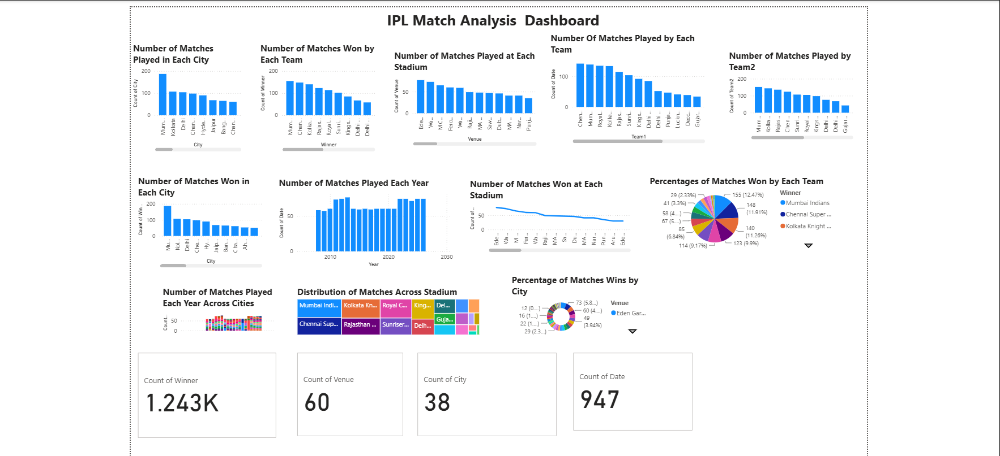

# IPL-Match--Analysis--Dashboard
Power  BI dashboard for IPL match analysis
# IPL Match Analysis Dashboard

## Project Overview
This project analyzes IPL match data using Python and Power BI.

## Tools Used
- Python
- Pandas
- Jupyter Notebook
- Power BI

## Dataset
- ipl_matches.csv

## Files
- IPL_Dashboard_Final.pbix
- IPL_project.ipynb
- IPL Matches Analysis Power BI.png

## Dashboard Preview

## Key Insights
- Matches played across cities
- Team-wise wins
- Stadium-wise analysis
- Year-wise trends
- Percentage of wins by teams

## Author
Sujeet Kumar
